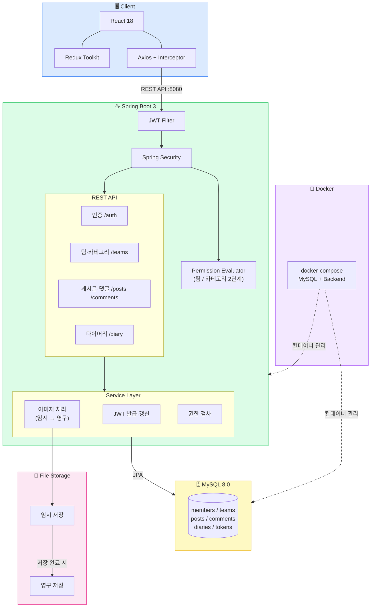

# Calendiary

> 팀 협업 게시판과 개인 다이어리를 하나로 통합한 웹 플랫폼

 

---

## 목차

- [프로젝트 소개](#프로젝트-소개)
- [주요 기능](#주요-기능)
- [기술 스택](#기술-스택)
- [시스템 아키텍처](#시스템-아키텍처)
- [ERD](#erd)
- [화면 미리보기](#화면-미리보기)
- [API 명세](#api-명세)
- [구현 시 고려한 사항](#구현-시-고려한-사항)

---

## 프로젝트 소개

Calendiary는 팀 단위의 협업 게시판과 개인 다이어리를 하나의 플랫폼에서 제공합니다.

팀 내에서는 카테고리별로 게시글을 관리하고, 역할 기반의 2단계 권한 시스템으로 세밀하게 접근을 제어합니다.
개인 다이어리는 달력 뷰와 리스트 뷰를 지원하며, 게시글별 공개/비공개 설정이 가능합니다.

> **개발 기간:** 2024.xx ~ 2025.xx

---

## 주요 기능

### 인증 / 회원
- 이메일 인증 기반 회원가입
- JWT Access Token + Refresh Token 인증
- 토큰 자동 갱신 (Axios 인터셉터)
- 임시 비밀번호 발급 (이메일 전송)

### 팀 협업 게시판
- 팀 생성 및 초대 링크를 통한 팀원 초대
- 팀 내 별명(닉네임) 설정
- 카테고리별 게시글 관리
- 게시글 / 댓글 작성, 수정, 삭제
- 카테고리 순서 드래그 앤 드롭으로 변경
- 작성자 클릭 시 해당 팀원의 게시글 / 댓글 활동 모아보기

### 2단계 권한 시스템
| 레벨 | 권한 항목 |
|------|----------|
| 팀 | 팀 정보 수정, 카테고리 관리, 멤버 추가/삭제, 역할 변경 |
| 카테고리 | 게시글 조회/작성/삭제, 댓글 작성/삭제 |

- 팀 내 역할(Role)에 권한을 부여하고, 팀원에게 역할을 할당하는 구조
- `@PreAuthorize` + 커스텀 `PermissionEvaluator`로 API 레벨에서 권한 검사
- 프론트엔드에서 권한에 따라 버튼 / 입력창 조건부 렌더링

### 개인 다이어리
- 게시글별 공개 / 비공개 설정
- 달력 뷰: 날짜별 다이어리 썸네일 표시
- 리스트 뷰: 작성된 다이어리 목록 조회
- 다이어리 내 이미지 업로드 및 대표 이미지 자동 썸네일 지정
- 다이어리 / 게시글 내 키워드 검색

---

## 기술 스택

### Backend
| 분류 | 기술 |
|------|------|
| Language |  |
| Framework |   |
| ORM |  |
| Database |  |
| Auth |  |
| Build |  |
| Mail |  |

### Frontend
| 분류 | 기술 |
|------|------|
| Framework |  |
| 상태 관리 |  |
| HTTP |  |
| 에디터 |  |
| 보안 |  |

### Infra
| 분류 | 기술 |
|------|------|
| 컨테이너 |  |
| 버전 관리 |   |

---

## 시스템 아키텍처

---

## ERD

---

## 화면 미리보기

### 로그인 / 회원가입
| 로그인 | 회원가입 |
|--------|---------|
| 추가 예정 | 추가 예정 |

### 팀 협업 게시판
| 팀 초대 | 팀 가입 |
|---------|---------------|
|   |  |

| 팀 메인 | 카테고리 글 목록 |
|---------|---------------|
| 추가 예정 | 추가 예정 |

| 게시글 상세 | 게시글 작성 |
|-----------|-----------|
| 추가 예정 | 추가 예정 |

### 권한 관리
| 팀 정보 / 역할 설정 | 카테고리 권한 설정 |
|------------------|----------------|
| 추가 예정 | 추가 예정 |

### 개인 다이어리
| 달력 뷰 | 리스트 뷰 |
|--------|---------|
| 추가 예정 | 추가 예정 |

| 다이어리 작성 | 다이어리 상세 |
|------------|------------|
| 추가 예정 | 추가 예정 |

---
## API 명세

인증

| Method | URL | 설명 |
|--------|-----|------|
| POST | `/auth/register` | 회원가입 |
| POST | `/auth/authenticate` | 로그인 |
| POST | `/auth/refresh-token` | Access Token 갱신 |
| POST | `/auth/logout` | 로그아웃 |
| POST | `/auth/get-temp-password` | 임시 비밀번호 발급 |

팀

| Method | URL | 설명 |
|--------|-----|------|
| POST | `/teams/create` | 팀 생성 |
| GET | `/teams/{teamId}` | 팀 정보 조회 |
| PUT | `/teams/{teamId}/edit` | 팀 정보 수정 |
| GET | `/teams/{teamId}/invite` | 초대 링크 생성 |
| POST | `/teams/{teamId}/invite/validate` | 초대 링크 검증 및 가입 |
| DELETE | `/teams/{teamId}/leave` | 팀 탈퇴 |

카테고리 / 게시글 / 댓글

| Method | URL | 설명 |
|--------|-----|------|
| POST | `/teams/{teamId}/categories/create` | 카테고리 생성 |
| PUT | `/teams/{teamId}/categories/{categoryId}/order` | 카테고리 순서 변경 |
| GET | `/teams/{teamId}/category/{categoryId}/posts` | 게시글 목록 |
| POST | `/teams/{teamId}/category/{categoryId}/posts` | 게시글 작성 |
| GET | `/category/{categoryId}/posts/{postId}/comments` | 댓글 목록 |
| POST | `/category/{categoryId}/posts/{postId}/comments` | 댓글 작성 |

권한 확인

| Method | URL | 설명 |
|--------|-----|------|
| GET | `/permission-check?permission=&targetId=` | 단일 권한 확인 |
| GET | `/permissions-check?permissions=&targetId=` | 다중 권한 확인 |
| GET | `/edit-delete-check/post?postId=` | 게시글 수정/삭제 권한 |
| GET | `/edit-delete-check/comment?commentId=` | 댓글 수정/삭제 권한 |

다이어리

| Method | URL | 설명 |
|--------|-----|------|
| POST | `/diary/create` | 다이어리 작성 |
| GET | `/diary/{diaryId}` | 다이어리 조회 |
| GET | `/diary/calendar?year=&month=` | 달력 뷰 데이터 |
| GET | `/diary/list?year=&month=` | 리스트 뷰 데이터 |

---

## 구현 시 고려한 사항

### JWT 토큰 갱신 전략
- Access Token 만료 시 Axios 응답 인터셉터에서 자동으로 Refresh Token을 사용해 갱신
- 갱신 요청이 중복 발생하지 않도록 큐(queue) 방식으로 처리
- `/auth/**` 경로는 갱신 인터셉터에서 제외하여 로그인 에러가 정상적으로 전달되도록 처리

### 2단계 권한 시스템 설계
- 팀 레벨(`TeamPermission`)과 카테고리 레벨(`CategoryPermission`)을 별도 Enum으로 분리
- Spring Security의 `PermissionEvaluator`를 구현하여 `@PreAuthorize`에서 통일된 방식으로 권한 검사
- 프론트엔드에서 페이지 진입 시 권한을 미리 확인하고, 결과에 따라 버튼 및 입력창을 조건부 렌더링

### 이미지 처리
- CKEditor에서 이미지 업로드 시 서버에 임시 저장 후, 게시글/다이어리 저장 시점에 영구 경로로 이동
- 첫 번째 이미지를 자동으로 썸네일로 지정
- 게시글/다이어리 삭제 시 연관 이미지 파일도 함께 삭제
