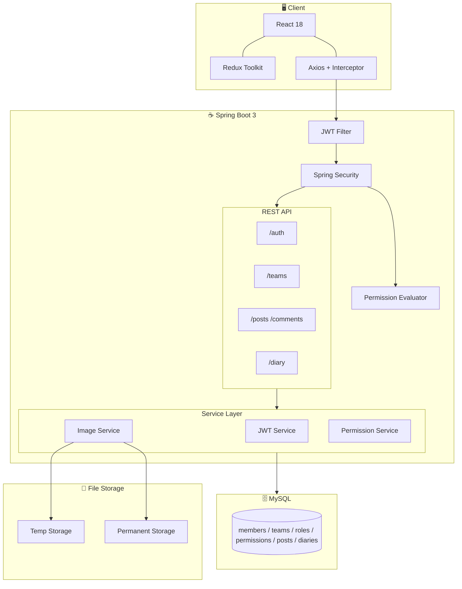

# 📅 Calendiary

**팀 협업 게시판과 개인 다이어리를 하나로 통합한 웹 플랫폼**

팀 단위 협업 게시판과 개인 다이어리를 함께 제공하며, 역할 기반 권한 시스템을 통해 세밀한 접근 제어를 지원하는 웹 서비스

<br/>


---

# 프로젝트 소개

Calendiary는 팀 협업 게시판과 개인 다이어리를 하나의 플랫폼에서 제공하는 웹 서비스입니다.

팀 단위 협업에서는 역할(Role) 기반 권한 시스템을 통해 카테고리별 접근 권한을 세밀하게 제어할 수 있으며, 개인 공간에서는 이미지 기반 다이어리를 작성하고 캘린더 형태로 기록을 관리할 수 있습니다.


### 개발 인원

개인 프로젝트 (1인 개발)

---

# Problem & Motivation

* 팀 협업 게시판은 많지만 개인 기록 공간은 별도 서비스에 의존하는 경우가 많음
* 게시판 운영 시 역할별 접근 권한을 세밀하게 제어하기 어려운 경우가 많음
* 개인 기록을 날짜 기반으로 관리하면서 이미지 중심으로 회고할 수 있는 공간이 필요했음
* 협업 공간과 개인 기록 공간을 하나의 서비스에서 제공하고자 개발

---

# 핵심 설계 포인트

* Team / Category 2단계 권한 시스템 설계
* Bitmask 기반 권한 저장 구조 적용
* Spring Security `PermissionEvaluator` 기반 권한 검사
* JWT Access / Refresh Token 인증 및 자동 갱신
* Refresh Queue 기반 중복 토큰 갱신 방지
* Temp → Permanent 이미지 저장 파이프라인
* CKEditor + DOMPurify + HtmlSanitizer 기반 XSS 방어
* ConcurrentHashMap 기반 조회수 캐싱

---

# 주요 기능

| 기능        | 설명                                 |
| --------- | ---------------------------------- |
| 인증        | 이메일 인증, JWT Access / Refresh Token |
| 팀 관리      | 팀 생성 및 초대 링크 기반 팀 가입               |
| 역할 관리     | 역할 생성 및 팀 권한 설정                    |
| 카테고리 권한   | 역할별 게시글/댓글 권한 관리                   |
| 게시판       | 게시글 및 댓글 CRUD                      |
| 사용자 활동 조회 | 팀원별 게시글/댓글 활동 조회                   |
| 개인 다이어리   | 공개/비공개 다이어리 작성                     |
| 다이어리 탐색   | 캘린더 뷰 및 리스트 뷰 제공                   |
| 이미지 관리    | CKEditor 이미지 업로드 및 썸네일 자동 생성       |

---

# Screenshots

## Team Collaboration

### [게시글 목록]


### [팀 초대 - 링크 생성]


### [팀 초대 - 링크 접속]


### [사용자 활동]


## Personal Diary

### [캘린더]


### [리스트]


---

# 기술 스택

## Backend

* Java 17
* Spring Boot 3
* Spring Security
* JPA / Hibernate
* MySQL
* JWT
* Gradle

## Frontend

* React 18
* Redux Toolkit
* Axios
* CKEditor 5
* DOMPurify

## Infra

* Docker
* Docker Compose
* Git
* GitHub

---

# 시스템 아키텍처


```mermaid
graph TB
    subgraph Client["🖥️ Client"]
        React["React 18"]
        Redux["Redux Toolkit"]
        Axios["Axios + Interceptor"]
    end

    subgraph Backend["☕ Spring Boot 3"]
        JWTFilter["JWT Filter"]
        Security["Spring Security"]
        PermEval["Permission Evaluator"]

        subgraph API["REST API"]
            Auth["/auth"]
            Team["/teams"]
            Content["/posts /comments"]
            Diary["/diary"]
        end

        subgraph Service["Service Layer"]
            JWTSvc["JWT Service"]
            ImageSvc["Image Service"]
            PermSvc["Permission Service"]
        end
    end

    subgraph DB["🗄️ MySQL"]
        Tables[("members / teams / roles / permissions / posts / diaries")]
    end

    subgraph Storage["📁 File Storage"]
        Temp["Temp Storage"]
        Perm["Permanent Storage"]
    end

    Axios --> JWTFilter
    JWTFilter --> Security
    Security --> PermEval
    Security --> API
    API --> Service
    Service --> DB
    ImageSvc --> Temp
    ImageSvc --> Perm

    React --- Redux
    React --- Axios
```

### 아키텍처 특징

* JWT 기반 인증 구조 적용
* Spring Security 기반 권한 검사
* 역할 및 카테고리 권한 분리
* 게시글/다이어리 이미지 파일 관리
* Docker 기반 개발 환경 구성

---

# Database Schema


## 권한 구조

```text
Member
  │
  ▼
TeamMember
  │
  ▼
TeamRole
  │
  ├── Team Permission
  │
  └── CategoryRolePermission
           │
           ▼
      TeamCategory
```

* TeamRole은 팀 관리 권한을 담당
* TeamMember는 팀 내 사용자 역할을 담당
* CategoryRolePermission은 카테고리별 세부 권한을 담당

### 역할 관리


### 카테고리 권한


---

# Technical Decisions

## Bitmask 기반 권한 관리

권한을 문자열로 관리하는 대신 Bitmask 구조로 저장하여 저장 공간을 줄이고 권한 검사 성능을 개선했습니다.

팀 권한과 카테고리 권한을 각각 비트 플래그 형태로 관리하여 확장성과 유지보수성을 확보했습니다.

---

## JWT Refresh Queue

동시에 여러 API 요청이 발생한 상황에서 Access Token이 만료될 경우 Refresh 요청이 중복 발생할 수 있습니다.

이를 해결하기 위해 Refresh 진행 중에는 후속 요청을 대기시키고, 갱신 완료 후 순차적으로 재실행하는 Queue 구조를 적용했습니다.

---

## 이미지 처리 파이프라인

이미지는 업로드 직후 임시 저장소에 저장되며, 게시글 또는 다이어리 저장 시 영구 저장소로 이동합니다.

```text
Upload
 → Temp Storage
 → Save Content
 → Permanent Storage
```

이를 통해 저장 취소 시 발생하는 불필요한 파일 생성을 최소화했습니다.

또한 UUID 기반 파일명을 사용하여 파일명 충돌을 방지했습니다.

---

## 조회수 캐싱

게시글 조회 시마다 DB를 갱신하지 않고 ConcurrentHashMap과 AtomicLong 기반 캐시에 누적한 뒤 주기적으로 반영하도록 구현했습니다.

이를 통해 DB Write 부하를 줄이고 동시성 환경에서 안정적으로 조회수를 처리할 수 있도록 구성했습니다.

---

## XSS 방어

CKEditor 기반 Rich Text 입력을 안전하게 처리하기 위해 클라이언트와 서버 양쪽에서 Sanitizing을 수행했습니다.

* Frontend : DOMPurify
* Backend : HtmlSanitizer

이중 검증 구조를 통해 악성 스크립트 삽입 가능성을 최소화했습니다.

---


## 만료 토큰 정리

Refresh Token 저장 테이블의 크기 증가를 방지하기 위해 Scheduler 기반 토큰 정리 작업을 구현했습니다.

만료된 토큰을 주기적으로 삭제하여 인증 데이터의 관리 비용을 줄였습니다.

---

